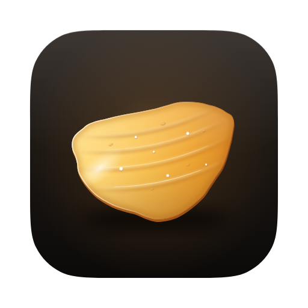

<p align="center">
  
</p>

<h1 align="center">Crispy</h1>
<p align="center"><em>One keyboard. One mouse. Every computer.</em></p>

Crispy lets one keyboard and mouse drive your Mac and your Windows PC. Move the cursor off the
edge of one screen and it appears on the other computer, with the keyboard following it. Copy on
one computer and paste on the other. Drop files onto a computer to send them there.

There is **no server and no client**. Each computer runs the same app as an equal peer. The
computer whose keyboard and mouse you are using drives the others. Connections are direct and
end-to-end encrypted on your local network. There is no account and no cloud.

## Features

- **Keyboard and mouse sharing.** Switch by moving across a shared screen edge, with sub-millisecond
  local handling. Keys are sent by physical position, so every keyboard layout works.
- **Display arrangement.** Drag your computers into place on a canvas that shows every monitor to
  scale. The arrangement syncs to all your computers. A live cursor shows where you are.
- **Clipboard sync.** Text, rich text and images sync instantly. Copied files are delivered when you
  move to the other computer, so you can copy a file on the Mac and paste it in Explorer.
- **File transfer.** Drop files or folders on a device, use Explorer's **Send to → Crispy**, or drop
  them on Crispy's Dock icon. Folder structure and timestamps are kept, and progress, speed and ETA
  are shown.
- **Mac ⇄ PC keyboard mapping.** ⌘C on a Mac keyboard becomes Ctrl+C on Windows, and the reverse.
  Every modifier can be remapped, or set to "Physical".
- **Many settings**, including:
  - edge delay, double-tap to switch, corner dead zones
  - "don't switch while dragging", switch only while a chosen modifier is held
  - full-screen game protection, direct or proportional edge mapping
  - pointer and scroll speed, scroll inversion, smooth scrolling, relative movement for games
  - media keys, Caps Lock sync, four global hotkeys
  - clipboard filters and size limits
  - save folder, conflict policy, bandwidth limit, auto-accept
  - manual IP peers, port, heartbeat
  - log level, live stats
  - six chip-flavoured accent colours, light and dark themes, and window translucency (Mica on
    Windows 11, vibrancy on macOS)

### Default hotkeys

| Action | Shortcut |
|---|---|
| Lock cursor to this screen | Ctrl + Alt/⌥ + Shift + **L** |
| Bring cursor home | Ctrl + Alt/⌥ + Shift + **H** |
| Jump to next computer | Ctrl + Alt/⌥ + Shift + **N** |
| Pause sharing | Ctrl + Alt/⌥ + Shift + **P** |

You can change all four in **Settings → Shortcuts**.

## Install

Crispy must run on **every** computer you want to share between. Both computers must be on the
same network.

### Windows

1. Run `Crispy_1.0.0_x64-setup.exe`. No admin rights are needed.
2. The build isn't code-signed yet, so SmartScreen may warn you. Click **More info → Run anyway**.
3. When Windows Firewall asks, allow Crispy on **private networks**. Crispy uses TCP and UDP port
   24727 on your LAN.

### macOS (11 Big Sur or newer, Apple Silicon or Intel)

1. Open `Crispy.dmg` and drag Crispy to Applications.
2. The build isn't notarized yet. The first time, right-click Crispy and choose **Open**, then
   **Open** again. If macOS says the app is damaged, run
   `xattr -dr com.apple.quarantine /Applications/Crispy.app`.
3. Grant **Accessibility** when asked, under System Settings → Privacy & Security → Accessibility.
   Crispy needs it to read and control the keyboard and mouse. It starts working as soon as you
   flip the switch, without a restart. After installing an update you may need to turn the switch
   off and on again.

### Pair your computers

1. Open Crispy on both computers. Each one appears under **Nearby** on the other.
2. Click **Pair** on one computer. The other shows a 6-digit code. Type it on the first.
3. Open **Arrangement** and drag the computers to match your desk. Then move the cursor across the
   glowing edge.

If discovery is blocked (some office or guest Wi-Fi), use **Add by IP** with the address shown in
Settings → Network & Security.

## How it works

```
 Mac                                         Windows PC
┌───────────────────────────┐              ┌───────────────────────────┐
│ Quartz event tap ─┐       │   Noise XX   │       ┌─ Low-level hooks   │
│                   ▼       │  encrypted   │       ▼                    │
│   Crispy engine (peer) ◀──┼─── TCP ──────┼──▶ Crispy engine (peer)    │
│                   │       │              │       │                    │
│ CGEventPost ◀─────┘       │  UDP beacons │       └─▶ SendInput        │
└───────────────────────────┘              └───────────────────────────┘
```

- **Peers, not roles.** One actor task owns all state on each computer. The computer whose physical
  input is in use sends `Enter`, `Key`, `MouseMove` and similar messages to the computer under the
  cursor. Touching the other computer's own mouse takes control back instantly.
- **Security.**
  - Every connection runs a Noise `XX_25519_ChaChaPoly_BLAKE2s` handshake.
  - Pairing uses a SPAKE2 password-authenticated key exchange bound to that handshake, so the
    6-digit code can't be brute-forced offline, and a man in the middle gets one guess in a
    million per attempt.
  - Only paired keys are trusted.
  - Received file paths are sanitised, so a peer can't write outside your save folder.
- **Discovery.** Each computer sends UDP broadcast beacons on every interface and answers beacons it
  hears directly. Peers added by IP are also beaconed directly.
- **Responsiveness.** Input events go on a priority lane ahead of bulk data, so a large file transfer
  never makes the mouse lag. Absolute moves are coalesced in each send batch.
- **Fail-safe.**
  - Keys and buttons held during a switch are released correctly.
  - A dropped connection returns the cursor home immediately.
  - On Windows, the hidden system cursor is restored even after a crash.

## Building from source

Requirements: Rust (stable), Node 22, and the [Tauri prerequisites](https://v2.tauri.app/start/prerequisites/)
for your OS.

```sh
npm install
npm run tauri dev        # run the app
npm run tauri build      # installers in target/release/bundle
cargo test -p crispy-core
```

You can also preview the UI in a normal browser with a mock backend: run `npm run dev` and open
http://localhost:1420. Try `?os=windows`, `?theme=light`, `?onboarding=1` or `?pairing=enterCode`.

**CI.** Every push builds the macOS universal `.dmg` and the Windows `.exe` and `.msi` installers.
Download them from the workflow run's **Artifacts**. Pushing a tag like `v1.0.0` creates a draft
GitHub release with the installers attached.

**Cross-building the Windows installer on Linux.** This needs `mingw-w64` and `nsis`:
`npx tauri build --target x86_64-pc-windows-gnu --bundles nsis`.

### Project layout

```
crates/crispy-core/        the engine (platform-independent, fully tested)
  src/engine/              actor: input focus & switching, peers & pairing, clipboard, transfers
  src/net/                 Noise sessions, SPAKE2 pairing, LAN discovery
  src/platform/            Windows hooks + SendInput, macOS event taps + CGEvent, test mock
  src/layout.rs            shared screen arrangement & edge geometry
  src/keymap.rs            USB HID ⇄ Windows scan codes ⇄ macOS key codes
  tests/two_peers.rs       two full engines pairing and sharing over real encrypted TCP
src-tauri/                 desktop shell: window, tray, commands, installers
src/                       Svelte 5 UI
branding/                  the chip: logo, app icon, tray template (SVG + PNG)
```

## Known limitations

- **Windows admin windows.** Windows blocks input from normal apps into elevated windows (UAC
  prompts, Task Manager, apps run as administrator). Crispy can't control those unless it is also
  run as administrator.
- **Secure screens.** Ctrl+Alt+Del, the Windows sign-in screen and the macOS login window can't be
  controlled remotely.
- **Secure Keyboard Entry on macOS.** When an app has it on (password fields, some terminals),
  macOS stops all apps from reading the keyboard, so typing stays on the Mac. Crispy shows a notice
  when this happens.
- **Linux.** Crispy builds and the UI runs on Linux, but there is no native input integration yet,
  so a Linux machine can't share its keyboard and mouse.

## License

MIT. See [LICENSE](LICENSE).
